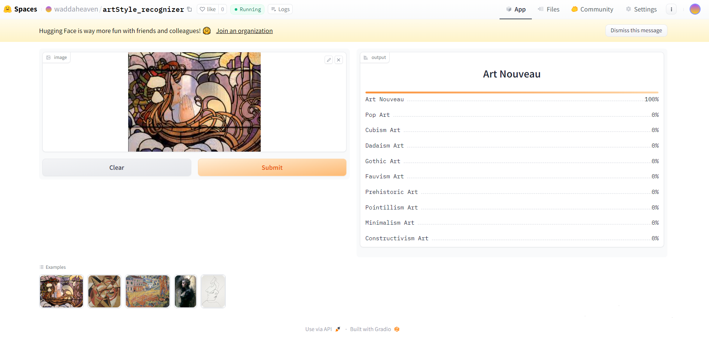

# Art-Style-Recognizer
An image classification model from data collection, cleaning, model training, deployment and API integration.
The model can classify 10 different types of art styles.
The types are the following:
1. Art Nouveau
2. Constructivism Art
3. Cubism Art
4. Dadaism Art
5. Fauvism Art
6. Gothic Art
7. Minimalism Art
8. Pointillism Art
9. Pop Art
10. Prehistoric Art

## Dataset Preparation
**Data Collection:** Downloaded from DuckDuckGo using term names. A total of 1890 images were collected. 
**DataLoader:** Used FastAI DataBlock API to set up the DataLoader. 
**Data Augmentation:** FastAI provides default data augmentation which operates in GPU. 
Details can be found in `notebooks/data_preparation.ipynb` 

## Training and Data Cleaning
**Training:** Fine-tuned resnet34 for 5 epochs (3 times) and achieved ~88% accuracy. 
**Data Cleaning:** As the data was collected from the browser, there were many noises. Also, some images contained irrelevant data. I cleaned and updated data using FastAI ImageClassifierCleaner. I cleaned the data each time after training or fine-tuning, except for the last time which was the final iteration of the model. 
You can check the data training and cleaning process in `notebooks/training_and_data_cleaning.ipynb` 

## Model Deployment
I deployed the model to the HuggingFace Spaces Gradio App. The implementation can be found in the `deployment` folder or [here](https://huggingface.co/spaces/waddaheaven/artStyle_recognizer) 

## API integration with GitHub Pages
The deployed model API is integrated [here](https://kaniz-fatema-nabila.github.io/Art-Style-Recognizer/) in the GitHub Pages Website. 
Implementation and other details can be found in the `docs` folder